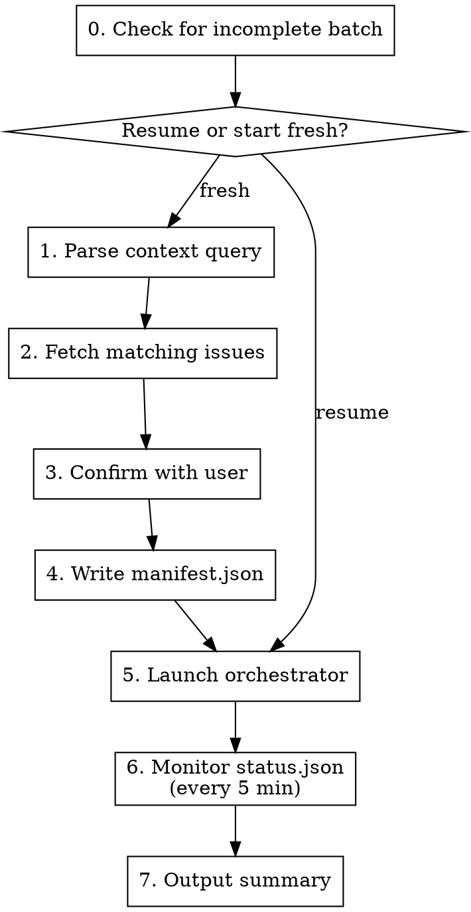

# Handle Issues

Batch process multiple GitHub issues by launching `batch-orchestrator.sh` which handles the execution loop, rate limits, and status tracking autonomously. This skill focuses on setup and monitoring.

**Announce at start:** "Using handle-issues to batch process issues. Query: $CONTEXT"

**Arguments:**
- `$1` — Context query describing which issues to process and how (required)

**Examples:**
- `/handle-issues "issues assigned to @me ordered by priority"`
- `/handle-issues "all open bugs labeled 'critical'"`
- `/handle-issues "issues in milestone v2.0 by creation date"`
- `/handle-issues "Tailwind removal issues 306-308"` (frontend work)
- `/handle-issues "critical bugs" --enrich-followups` — also enriches auto-created follow-up issues after the batch completes

**Flags:**
- `--enrich-followups` — after the main batch finishes, sweep every issue tagged `needs-explore` that was created during this batch run and invoke `/enrich-issue` on each one; see [Post-Batch Follow-up Enrichment](#post-batch-follow-up-enrichment) below

## Agent Selection

The orchestrator uses specialized agents via `--agent` flag to ensure the right expertise for each stage:

| Stage | Agent | Purpose |
|-------|-------|---------|
| implement-issue | project-specific agent | Use the agent matching the issue's domain (configured during /adapting-claude-pipeline) |
| implement-issue | (default) | General implementation |
| process-pr | `code-reviewer` | **Always** - reviews PR/MR for quality and standards |

**Determine agent based on issue content:**
- Check which agents are configured in `.claude/agents/` for this project
- Match the issue's domain to the appropriate agent
- **Mixed or unclear**: Use default (no agent specified)

**Ask user during confirmation** which agent to use if issue type is ambiguous.

## Architecture

```
┌─────────────────────────────────────────────────────────────────┐
│ handle-issues (this skill)                                      │
│  • Gathers issues via platform wrappers                          │
│  • Determines appropriate agent for issue type                  │
│  • Confirms with user (ONLY interaction point)                  │
│  • Writes manifest.json (includes agent)                        │
│  • Launches batch-orchestrator.sh (background)                  │
│  • Reads status.json every 5 minutes                            │
│  • Outputs summary when complete                                │
└─────────────────────────────────────────────────────────────────┘
                              │
                              ▼
┌─────────────────────────────────────────────────────────────────┐
│ batch-orchestrator.sh (shell script)                            │
│  • Loops through issues SEQUENTIALLY                            │
│  • Each issue: feature branch → implement → merge → next        │
│  • Parses structured_output via jq                              │
│  • Updates status.json after each operation                     │
│  • Handles rate limits, timeouts, circuit breaker               │
└─────────────────────────────────────────────────────────────────┘

Claude CLI invocations:
  claude -p "/implement-issue #N branch" \
    --agent <frontend|backend> \
    --dangerously-skip-permissions \
    --output-format json \
    --json-schema implement-issue.json

  claude -p "/process-pr #PR #issue branch" \
    --agent code-reviewer \
    --dangerously-skip-permissions \
    --output-format json \
    --json-schema process-pr.json
```

## Per-Issue Triage & Surgical Fast-Path

Inside `implement-issue-orchestrator.sh`, every issue passes through a
**triage** stage immediately after `parse-issue`. The triage classifier
(Haiku, ~$0.001/issue) decides one of two routes:

```
parse-issue ──► triage ──┬──► fast-path: branch → implement → commit → PR → squash-merge
                          │                  (skips: test loop, code review, deploy verify, docs)
                          │
                          └──► full:      branch → implement → quality loop → review → PR → ...
                                                  (the standard pipeline)
```

The fast-path lives in `.claude/scripts/surgical-fast-path.sh`. It is
deliberately the bare minimum — no test iterations, no review, no docs.
The triage classifier must be confident that a fast-path issue is safe to
ship without those gates.

### Six criteria — ALL must pass for fast-path

| # | Criterion | Disqualifies on |
|---|-----------|-----------------|
| 1 | `test_only_scope` | any reference to `apps/`, `packages/`, `src/`, migrations |
| 2 | `surgical_size` | > 30 lines net diff or > 3 files |
| 3 | `established_pattern` | no grep-able regex with ≥ 3 matching files in repo |
| 4 | `precise_specification` | missing `## Implementation Tasks` or vague file/line refs |
| 5 | `benign_failure_mode` | wrong change could break prod, not just fail a test |
| 6 | `no_security_concerns` | auth, RBAC, encryption, secrets, validation, CORS, sessions |

Confidence must be `high`. Anything less forces `full`. The shell wrapper
also re-runs `git grep -lE` on the classifier-supplied regex and downgrades
to `full` when fewer than 3 files match — defense in depth on top of the
prompt.

### Example fixtures (also used by triage-validate.sh)

| Fixture | Route | Why |
|---------|-------|-----|
| `issue-2836` quickLogin → storageState in 2 specs | fast-path | test-only, established pattern (5 prior migrations), precise |
| `issue-2837` fix stale E2E selectors | fast-path | test-only, well-specified |
| `issue-2838` retry/timeout tweak in E2E | fast-path | test-only, surgical |
| `issue-2839` remove premature toBeVisible() | fast-path | test-only, single file |
| `issue-2752` `hasBaseline` filter on `/api/farms` | full | backend code, not test-only |
| `issue-2754` zone overlap validator fix | full | production validator code |
| `issue-2776` `window.location.href` → `router.push()` | full | production component code |
| `issue-auth-test` add MFA assertion to auth-flow E2E | full | security concern, even though test-only |
| `issue-vague` "fix the timeout issue" | full | precise_specification fails |
| `issue-novel-pattern` first use of new `withRetry` helper | full | no established pattern (< 3 grep matches) |

### Operator controls

| Env var | Default | Effect |
|---------|---------|--------|
| `DISABLE_SURGICAL_FAST_PATH` | `0` | `1` forces every issue to the full pipeline regardless of classifier output. Use during incidents. |
| `TRIAGE_MODEL` | `haiku` (tier) | Override the model. Pass a tier name (`haiku`/`sonnet`/`opus`), not a pinned model ID — the tier-to-model mapping lives in `.claude/scripts/model-config.sh`. |
| `FAST_PATH_IMPLEMENT_MODEL` | `sonnet` | Model used by the fast-path implement step. |

### Pre-commit hook failure on fast-path

The fast-path commit runs hooks with no `--no-verify` bypass. If a hook
fails, the fast-path **bails cleanly** — it does NOT fall back to the full
pipeline. The script:

1. Captures the hook's stderr (capped at 4 KB) into `triage.json.hook_failure_output`.
2. Sets `state="failed"` and `error="pre_commit_hook_failed"` in `status.json`.
3. Exits 1 — counted by `batch-orchestrator.sh`'s circuit breaker as a real failure.

This is intentional. Falling back to `full` after a hook failure would mask
a triage misclassification (the issue was not really fast-path-safe). A
counted failure surface lets operators tune the criteria.

### Test contract

Two test layers protect the triage system. Both must stay green:

- `.claude/scripts/implement-issue-test/test-surgical-fast-path.bats` —
  18 mock-based tests covering the shell logic (kill switch, confidence
  demotion, grep verification, status-file bookkeeping, fast-path step
  ordering, hook-failure handling). Run via `bats`.
- `.claude/scripts/triage-validate.sh` — real-Claude golden tests
  (~$0.10/run, ~100s) that exercise the actual prompt against all 10
  fixtures. **Run before merging changes to the prompt, schema, or
  triage tier model. Run monthly to catch model drift.** Do NOT
  auto-update the manifest when fixtures flip — investigate first.

## Proactive Usage Polling (skip exhausted models)

When `seven_day_sonnet` hits 100% but the all-models weekly cap still has
headroom, opus/haiku are still usable. Without this feature the orchestrator
would sleep ~1h waiting for sonnet to reset. With it, the orchestrator polls
the same private endpoint that menu-bar apps like Sneaky Penguin use, and
escalates sonnet → opus on the fly.

### How to enable

1. **Get your sessionKey.** Open `https://claude.ai` in any browser logged
   in to your account. Open DevTools (F12) → Console tab and paste:

   ```js
   document.cookie  // search the output for "sessionKey="
   ```

   If `sessionKey` isn't visible there (HttpOnly), use the Application tab →
   Cookies → `https://claude.ai` → row named `sessionKey`. Copy the long
   value starting `sk-ant-sid01-...`.

2. **Get your org UUID.** In DevTools Console, paste:

   ```js
   fetch('/api/organizations', {credentials: 'include'}).then(r => r.json()).then(o => console.log(o[0]?.uuid))
   ```

3. **Configure the env vars** (e.g. in `~/.zshrc`):

   ```bash
   export CLAUDE_USAGE_SESSION_KEY="sk-ant-sid01-..."
   export CLAUDE_USAGE_ORG_ID="your-org-uuid"
   ```

   For CI / shared boxes, prefer a 0600 file:

   ```bash
   echo "sk-ant-sid01-..." > ~/.claude-session-key && chmod 600 ~/.claude-session-key
   export CLAUDE_USAGE_SESSION_KEY_FILE=~/.claude-session-key
   ```

### Configuration env vars

| Var | Default | Purpose |
|-----|---------|---------|
| `CLAUDE_USAGE_SESSION_KEY` | (required to enable) | sessionKey cookie from claude.ai |
| `CLAUDE_USAGE_SESSION_KEY_FILE` | (alternative) | Path to 0600 file containing the key |
| `CLAUDE_USAGE_ORG_ID` | (required) | Organization UUID |
| `CLAUDE_USAGE_DISABLE` | `0` | `1` opts out — script behaves exactly as today |
| `CLAUDE_USAGE_SESSION_THRESHOLD` | `95` | `five_hour` cap (5-hour rate window — overage cannot absorb) |
| `CLAUDE_USAGE_MODEL_THRESHOLD` | `95` | `seven_day_sonnet` / `seven_day_opus` cap (per-model weekly) |
| `CLAUDE_USAGE_WEEKLY_THRESHOLD` | `98` | `seven_day` all-models weekly cap (last-resort circuit-breaker) |
| `CLAUDE_USAGE_EXTRA_THRESHOLD` | `90` | When `extra_usage.utilization` exceeds this, stop letting overage absorb |
| `CLAUDE_USAGE_CACHE_TTL` | `30` | Seconds — cache one response per 30s ≈ one API call per ~30 stages |

### Bucket-to-model mapping (verified against captured fixture)

| Model | Per-model bucket | Falls back to | Session gate |
|-------|------------------|---------------|--------------|
| sonnet | `seven_day_sonnet` | `seven_day` if null | `five_hour` |
| opus | `seven_day_opus` (often null) | `seven_day` if null | `five_hour` |
| haiku | _none_ | `seven_day` | `five_hour` |
| unknown | (not gated; returns 0) | — | — |

### Behavior

- **Hybrid fallback**: if `CLAUDE_USAGE_SESSION_KEY` is unset OR a fetch
  fails, `is_model_exhausted` returns false for everything. The reactive
  rate-limit handler (`handle_rate_limit`, sleeps for parsed wait time)
  remains as the safety net — no regression for users without a key.
- **Overage absorption**: paid plans with `extra_usage.is_enabled: true`
  have per-model exhaustion absorbed by overage billing. The script does
  NOT escalate when overage is below `EXTRA_THRESHOLD` — escalating
  prematurely would burn opus when sonnet calls would still have succeeded
  (just billed against overage).
- **Mid-run model oscillation**: each stage is a fresh Claude CLI
  invocation with no shared conversation context. If sonnet at 96%
  triggers escalation in stage 1, then resets mid-run and stage 3 sees
  it at 5%, stage 3 will use sonnet. This is expected and benign.
- **Cache location**: `${XDG_CACHE_HOME:-$HOME/.cache}/claude-pipeline/usage.json`.
  User-scoped, single source of truth across all worktrees and projects.
  Never accidentally committed.
- **`model_override` callsites bypass the gate**: stages with hard-coded
  models (e.g. PR creation pinned to opus) honor the explicit caller
  intent. If opus is exhausted in that case, the call surfaces an error
  rather than silently demoting.

### Security

- sessionKey is a long-lived bearer-equivalent for your claude.ai account.
- Read once into a local variable; passed to curl via `-H Cookie:` (header,
  not visible in `ps`); never echoed; never logged; never written to
  status.json or any artifact.
- The `test-claude-usage.bats` suite includes an explicit grep-the-key-out
  check on every code path's output.
- Known limitation: child process environment may show the value in
  `/proc/PID/environ` on some Linux configurations during the curl call.
  Acceptable on a single-user box; use the file-based alternative on shared
  hosts.

### Known limitations

- The endpoint at `https://claude.ai/api/organizations/{org}/usage` is
  undocumented. If it changes shape, parse failure → graceful fallback to
  reactive behavior + WARN log (ERROR if previous cache was valid, so the
  regression is visible).
- The double-timeout escalation path in `run_stage` (lines ~1188–1198)
  bypasses `effective_model`. Rare edge case; addressed in a follow-up.
- Empirical verification of whether `extra_usage` absorbs `five_hour` or
  `seven_day` exhaustion is pending — current code treats both as hard
  caps (conservative). Can be relaxed later if observed.

### Re-capturing the API fixture

If the response shape changes:

```bash
.claude/scripts/capture-usage-fixture.sh
```

(prompts for sessionKey + org UUID, writes to
`.claude/scripts/implement-issue-test/fixtures/usage-response.json`,
prints the discovered field names so the bucket mapping can be updated).

## Process



### Step 0: Check for Incomplete Batch

Before fetching issues, check if a previous batch was interrupted:

```bash
if [[ -f status.json ]]; then
    STATE=$(jq -r '.state' status.json)

    if [[ "$STATE" == "running" || "$STATE" == "circuit_breaker" ]]; then
        PROGRESS=$(jq -r '.progress | "\(.completed)/\(.total) complete, \(.failed) failed, \(.pending) pending"' status.json)
        LOG_DIR=$(jq -r '.log_dir' status.json)
        BRANCH=$(jq -r '.base_branch' status.json)

        echo "## Incomplete Batch Detected"
        echo ""
        echo "**State:** $STATE"
        echo "**Progress:** $PROGRESS"
        echo "**Branch:** $BRANCH"
        echo "**Log dir:** $LOG_DIR"
        echo ""

        # Show pending issues
        echo "**Pending issues:**"
        jq -r '.issues[] | select(.status == "pending" or .status == "in_progress") | "- #\(.number)"' status.json
        echo ""
    fi
fi
```

**Use AskUserQuestion with options:**
1. Resume (continue with pending issues)
2. Start fresh (abandon previous batch)

If resuming, skip to Step 5 (launch orchestrator). The orchestrator's idempotency check will skip completed issues.

### Step 1: Parse Context Query

Extract from the user's context query:
- **Filter criteria**: assignee, labels, milestone, author, state
- **Sort order**: priority, created, updated, comments
- **Limit**: max issues to process (default: no limit)

### Step 2: Fetch Matching Issues

Build and execute `gh` command based on parsed criteria:

```bash
PLATFORM_DIR=".claude/scripts/platform"

# Example: issues assigned to user
"$PLATFORM_DIR/list-issues.sh" --assignee "@me" --state open

# Example: critical bugs
"$PLATFORM_DIR/list-issues.sh" --labels "bug,critical" --state open

# Example: Jira issues (when TRACKER=jira)
"$PLATFORM_DIR/list-issues.sh" --jql "project = KIN AND assignee = currentUser() ORDER BY priority DESC"
```

**Sort by priority** (if requested): Order by label priority:
1. `priority:critical` or `P0`
2. `priority:high` or `P1`
3. `priority:medium` or `P2`
4. `priority:low` or `P3`
5. No priority label

### Step 3: Display Issue List for Confirmation

Present the ordered list before processing:

```
Found N issues matching "$CONTEXT":

1. #123 - Fix login redirect loop [priority:high, bug]
2. #456 - Add password reset flow [priority:medium, feature]
3. #789 - Update user profile validation [priority:low, enhancement]

Base branch: aw-next

Proceed with batch processing? (yes/no)
```

**This is the ONLY user interaction point.** After confirmation, the entire batch runs autonomously.

**Use AskUserQuestion** to confirm:
- Option 1: "Yes, proceed"
- Option 2: "No, cancel"
- Allow user to specify different base branch if needed

### Step 4: Write Manifest

Create the manifest file for the orchestrator:

```bash
MANIFEST="logs/handle-issues/manifest-$(date +%Y%m%d-%H%M%S).json"
mkdir -p logs/handle-issues

# Build issues array from fetched list
# $AGENT is determined from issue type (frontend/backend/default)

# $ISSUE_IDS is a comma-separated list like "123,456,789" or "KIN-1,KIN-2,KIN-3"
jq -n \
  --arg issues "$ISSUE_IDS" \
  --arg branch "$BASE_BRANCH" \
  --arg query "$CONTEXT" \
  --arg agent "$AGENT" \
  '{
    issues: ($issues | split(",") | map(gsub("^\\s+|\\s+$"; ""))),
    base_branch: $branch,
    agent: (if $agent == "" then null else $agent end),
    query: $query,
    created_at: (now | todate)
  }' > "$MANIFEST"

echo "Manifest written to: $MANIFEST"
```

**Agent values:**
- Use project-specific agents configured in `.claude/agents/` during `/adapting-claude-pipeline`
- `null` or omitted — Default behavior

### Step 5: Launch Orchestrator

Launch the batch orchestrator as a background process:

```bash
# Launch orchestrator (agent is read from manifest, or can be overridden via --agent)
nohup .claude/scripts/batch-orchestrator.sh --manifest "$MANIFEST" \
  > "logs/handle-issues/orchestrator-$(date +%Y%m%d-%H%M%S).log" 2>&1 &

# Or with explicit agent override:
# nohup .claude/scripts/batch-orchestrator.sh --manifest "$MANIFEST" --agent bulletproof-frontend-developer \
#   > "logs/handle-issues/orchestrator-$(date +%Y%m%d-%H%M%S).log" 2>&1 &

ORCHESTRATOR_PID=$!
echo "$ORCHESTRATOR_PID" > logs/handle-issues/.orchestrator.pid

echo "Orchestrator launched (PID: $ORCHESTRATOR_PID)"
echo "Status file: status.json"
echo "Logs: logs/batch-*/"
```

The orchestrator will:
- Use the specified agent for `implement-issue` stage
- Always use `code-reviewer` agent for `process-pr` stage

### Step 6: Monitor Progress

The Bash tool has a 2-minute execution limit — `sleep 300` would never complete its second
iteration. Monitoring instead uses **ScheduleWakeup**: Claude runs the check block once, then
schedules a wakeup 270 seconds later (just under the 300-second prompt-cache TTL). On each
wakeup the check block reruns until the batch reaches a terminal state.

**Immediately after the orchestrator launches**, initialize the snapshot file and schedule the
first check:

```bash
# Capture baseline per-issue snapshot (bash 3.2 compatible — no declare -A)
jq -r '[.issues[] | .number + "=" + .status] | join(",")' status.json \
    > logs/handle-issues/.status-snapshot
echo "Monitoring started. First check in 270s."
```

Then call `ScheduleWakeup` with `delaySeconds=270`, `reason="handle-issues batch polling"`, and
`prompt="Re-run the Step 6 check block for handle-issues — poll status.json for transitions"`.

**Check block** — run once per wakeup, then reschedule or proceed to the completion block:

```bash
BASE_BRANCH=$(jq -r '.base_branch' status.json)
LOG_DIR=$(jq -r '.log_dir' status.json)
STATE=$(jq -r '.state' status.json)
COMPLETED=$(jq -r '.progress.completed' status.json)
FAILED=$(jq -r '.progress.failed' status.json)
TOTAL=$(jq -r '.progress.total' status.json)
CURRENT=$(jq -r '.current_issue // "none"' status.json)
CURRENT_STAGE=$(jq -r '.current_stage // ""' status.json)
STAGE_STARTED_AT=$(jq -r '.stage_started_at // ""' status.json)
RATE_LIMITED=$(jq -r '.rate_limit.waiting' status.json)

# Expected timeouts per stage (seconds) — used for stuck detection
_stage_timeout() {
    case "$1" in
        implement-issue) echo 3600 ;;  # 60 min
        process-pr)      echo 1800 ;;  # 30 min
        *)               echo 3600 ;;  # default 60 min
    esac
}

# Compute stage elapsed time
ELAPSED_STR=""
STUCK_WARNING=""
if [[ -n "$STAGE_STARTED_AT" && "$STAGE_STARTED_AT" != "null" ]]; then
    NOW=$(date +%s)
    # Parse ISO 8601 — try GNU date first, fall back to BSD date (macOS)
    STAGE_START=$(date -d "$STAGE_STARTED_AT" +%s 2>/dev/null \
        || date -j -f "%Y-%m-%dT%H:%M:%SZ" "$STAGE_STARTED_AT" +%s 2>/dev/null \
        || echo "")
    if [[ -n "$STAGE_START" && "$STAGE_START" =~ ^[0-9]+$ ]]; then
        ELAPSED=$(( NOW - STAGE_START ))
        ELAPSED_MIN=$(( ELAPSED / 60 ))
        ELAPSED_SEC=$(( ELAPSED % 60 ))
        ELAPSED_STR=" (${ELAPSED_MIN}m ${ELAPSED_SEC}s running)"
        STAGE_TIMEOUT=$(_stage_timeout "$CURRENT_STAGE")
        THRESHOLD=$(( STAGE_TIMEOUT * 80 / 100 ))
        if (( ELAPSED > THRESHOLD )); then
            STUCK_WARNING="⚠️ Stage running longer than expected — may need attention"
        fi
    fi
fi

# Lines changed vs base branch
LINES_CHANGED=$(git diff "$BASE_BRANCH"...HEAD --shortstat 2>/dev/null \
    | grep -oE '[0-9]+ insertion|[0-9]+ deletion' \
    | grep -oE '[0-9]+' | paste -sd+ | bc 2>/dev/null || echo "0")

if [[ "$RATE_LIMITED" == "true" ]]; then
    RESUME_AT=$(jq -r '.rate_limit.resume_at' status.json)
    echo "[$(date +%H:%M)] $COMPLETED/$TOTAL | #$CURRENT $CURRENT_STAGE$ELAPSED_STR | Lines: $LINES_CHANGED | Rate limited until $RESUME_AT"
else
    echo "[$(date +%H:%M)] $COMPLETED/$TOTAL | #$CURRENT $CURRENT_STAGE$ELAPSED_STR | Lines: $LINES_CHANGED"
fi
[[ -n "$STUCK_WARNING" ]] && echo "$STUCK_WARNING"

# Per-issue transition detection (bash 3.2-compatible snapshot diff — no declare -A)
PREV_SNAPSHOT=$(cat logs/handle-issues/.status-snapshot 2>/dev/null || echo "")
CURR_SNAPSHOT=$(jq -r '[.issues[] | .number + "=" + .status] | join(",")' status.json)

if [[ "$CURR_SNAPSHOT" != "$PREV_SNAPSHOT" ]]; then
    while IFS='=' read -r num status; do
        prev_status=$(printf '%s' "$PREV_SNAPSHOT" \
            | tr ',' '\n' | grep "^${num}=" | cut -d'=' -f2)
        [[ "$status" == "$prev_status" ]] && continue
        case "$status" in
            completed)
                PR=$(jq -r --arg n "$num" \
                    '.issues[] | select(.number == ($n | tonumber)) | .pr // empty' \
                    status.json)
                if [[ -n "$PR" ]]; then
                    echo "✅ #${num} completed — PR #${PR} merged"
                else
                    echo "✅ #${num} completed"
                fi
                ;;
            failed)
                # Read stage-level detail; fall back to top-level error if file absent
                ISSUE_STATUS_FILE="${LOG_DIR}/issue-${num}-status.json"
                if [[ -f "$ISSUE_STATUS_FILE" ]]; then
                    FAIL_STAGE=$(jq -r '.current_stage // "unknown"' \
                        "$ISSUE_STATUS_FILE")
                    ERROR_KIND=$(jq -r \
                        --arg s "$FAIL_STAGE" \
                        '.stages[$s].error_kind // .error // "unknown"' \
                        "$ISSUE_STATUS_FILE")
                    echo "❌ #${num} failed at ${FAIL_STAGE}: ${ERROR_KIND}"
                else
                    ERR=$(jq -r --arg n "$num" \
                        '.issues[] | select(.number == ($n | tonumber)) | .error // "unknown"' \
                        status.json)
                    echo "❌ #${num} failed: ${ERR}"
                fi
                ;;
            merge_blocked)
                echo "⚠️ #${num} merge blocked"
                ;;
        esac
    done < <(printf '%s' "$CURR_SNAPSHOT" | tr ',' '\n')
    printf '%s\n' "$CURR_SNAPSHOT" > logs/handle-issues/.status-snapshot
fi
```

If `STATE` is **not** `completed`, `completed_with_errors`, or `circuit_breaker`, call
`ScheduleWakeup` again with `delaySeconds=270`. Otherwise run the **completion block** below.

**Completion block** — run once when the batch reaches a terminal state:

```bash
STATE=$(jq -r '.state' status.json)
COMPLETED=$(jq -r '.progress.completed' status.json)
FAILED=$(jq -r '.progress.failed' status.json)
TOTAL=$(jq -r '.progress.total' status.json)
LOG_DIR=$(jq -r '.log_dir' status.json)

echo ""
echo "## Handle Issues Complete"
echo ""
echo "**State:** $STATE"
echo "**Progress:** $COMPLETED/$TOTAL completed, $FAILED failed"
# Issues whose orchestrator exited with state="merge_blocked" (BLOCK_MERGE_ON_CONVERGENCE_FAILURE
# gate) are surfaced as a distinct `merge_blocked` column in `.progress` — counted separately.
echo ""
echo "### Results"
echo ""
echo "| Issue | PR | Status | Follow-ups |"
echo "|-------|-----|--------|------------|"

jq -r '.issues[] | "| #\(.number) | \(if .pr then "#\(.pr)" else "—" end) | \(.status) | \(.follow_ups // [] | if length > 0 then map("#\(.)") | join(", ") else "—" end) |"' status.json

# Show failures with stage-level detail from issue-NNN-status.json
if [[ $FAILED -gt 0 ]]; then
    echo ""
    echo "### Failed Issues"
    echo ""
    while read -r num; do
        ISSUE_STATUS_FILE="${LOG_DIR}/issue-${num}-status.json"
        if [[ -f "$ISSUE_STATUS_FILE" ]]; then
            FAIL_STAGE=$(jq -r '.current_stage // "unknown"' "$ISSUE_STATUS_FILE")
            ERROR_KIND=$(jq -r \
                --arg s "$FAIL_STAGE" \
                '.stages[$s].error_kind // .error // "unknown"' \
                "$ISSUE_STATUS_FILE")
            echo "- **#${num}**: failed at ${FAIL_STAGE}: ${ERROR_KIND}"
        else
            ERR=$(jq -r --arg n "$num" \
                '.issues[] | select(.number == ($n | tonumber)) | .error // "Unknown error"' \
                status.json)
            echo "- **#${num}**: ${ERR}"
        fi
    done < <(jq -r \
        '.issues[] | select(.status == "failed" or .status == "skipped") | .number' \
        status.json)
fi

# Show circuit breaker message if triggered
if [[ "$STATE" == "circuit_breaker" ]]; then
    echo ""
    echo "### Circuit Breaker Triggered"
    echo ""
    echo "3 consecutive failures detected. Batch stopped to prevent further issues."
    echo ""
    echo "**To resume:** Fix the underlying issues, then run:"
    echo "\`/handle-issues \"resume\"\`"
fi

echo ""
echo "**Logs:** $LOG_DIR"

# Extract and report follow-up issues
FOLLOWUPS=$(jq -r '[.issues[].follow_ups // [] | .[]] | unique | join(" ")' status.json)
if [[ -n "$FOLLOWUPS" ]]; then
    echo ""
    echo "Follow-up issues found: ${FOLLOWUPS}. Run: /handle-issues ${FOLLOWUPS} on branch main"
fi

# macOS batch-end notification (silently skipped if osascript is unavailable)
if command -v osascript >/dev/null 2>&1; then
    osascript -e "display notification \"$COMPLETED/$TOTAL completed, $FAILED failed\" \
        with title \"handle-issues done\" sound name \"Glass\""
fi
```

## Post-Batch Follow-up Enrichment

When a `handle-issues` batch creates follow-up issues (via the `adjacent_issues` path during PR review or the `process-pr` precise path post-merge), those issues are created quickly with a minimal body: parent reference, raw description, and a single synthesised `[default] (M) <title>` task line. They are automatically tagged with the `needs-explore` label and contain a `<!-- pipeline-autocreated -->` HTML comment marker.

Running `/handle-issues` with `--enrich-followups` (or `batch-orchestrator.sh --enrich-followups`) triggers a post-batch sweep that calls `/enrich-issue N` on each follow-up created during the current batch:

```bash
# Launch orchestrator with enrichment sweep enabled
nohup .claude/scripts/batch-orchestrator.sh --manifest "$MANIFEST" --enrich-followups \
  > "logs/handle-issues/orchestrator-$(date +%Y%m%d-%H%M%S).log" 2>&1 &
```

**Sweep behaviour:**
- Only processes issues with the `needs-explore` label created since `BATCH_START_TIME` (scoped to this batch — does not touch prior batches' follow-ups)
- Enrichment failures are logged but do **not** fail the batch or trigger the circuit breaker
- Use `--enrich-all-needs-explore` (an explicit operator opt-in on `batch-orchestrator.sh`) to sweep ALL `needs-explore` issues regardless of creation time

### `/enrich-issue` Skill

The `/enrich-issue N` skill reads an existing issue, verifies the `<!-- pipeline-autocreated -->` marker is present (bails with a no-op if it's missing — guards against overwriting a human-edited body), then runs the same research + planning pipeline as `/explore` and rewrites the issue body in place:

- Context, Research Findings, Relevant Existing Tests, Evaluation (approaches + risks)
- Parseable file-scoped implementation tasks
- Acceptance Criteria

On success it removes the `needs-explore` label. The skill is **idempotent**: running it on an already-enriched issue (marker absent or label already removed) produces a clear log message and exits without modifying the issue.

**When to use manually:**
```
/enrich-issue 456
```
Useful for any sparsely-described issue — whether pipeline-created or filed by a human with a `needs-explore` label applied manually.

> **Deprecation note:** The `process-pr` vague path previously invoked `/explore` as a nested Claude CLI subprocess (`claude --dangerously-skip-permissions --print "/explore <description>"`). That approach is fragile — no observability, no log capture into the parent run, exit-code-only signal — and is now **deprecated**. Both the precise and vague `process-pr` paths use the label-and-sweep pattern instead: create a minimal issue tagged `needs-explore`, and rely on `/enrich-issue` (triggered manually or via `--enrich-followups`) to research and rewrite the body. This makes enrichment observable and opt-in rather than silent and mandatory.

## Files

| File | Purpose |
|------|---------|
| `.claude/scripts/batch-orchestrator.sh` | Main orchestration script (loops through issues); supports `--enrich-followups` flag |
| `.claude/scripts/schemas/implement-issue.json` | JSON schema for implement-issue output |
| `.claude/scripts/schemas/process-pr.json` | JSON schema for process-pr output |
| `status.json` | Real-time status (read by this skill, written by orchestrator) |
| `logs/handle-issues/manifest-*.json` | Batch manifest (issues list + branch) |
| `logs/batch-*/` | Per-batch logs and summary |
| `logs/.batch-orchestrator.lock` | Lock file preventing parallel batches |

## Integration

**Requires:**
- `.claude/scripts/batch-orchestrator.sh` (orchestration script)
- `.claude/scripts/schemas/*.json` (JSON schemas)
- `implement-issue` skill (invoked by orchestrator)
- `process-pr` skill (invoked by orchestrator)
- `enrich-issue` skill (invoked by orchestrator when `--enrich-followups` is set)
- Platform CLI authenticated (gh, glab, or acli — configured in .claude/config/platform.sh)
- `jq` for JSON parsing
- Claude Code CLI installed

**Creates:**
- One PR per issue (via implement-issue)
- Merged PRs with closed issues (via process-pr)
- Follow-up issues from review comments (via process-pr), tagged `needs-explore` with `<!-- pipeline-autocreated -->` marker
- Enriched follow-up issues with full research + planning (when `--enrich-followups` is set, via enrich-issue)
- status.json with real-time progress
- Log directory with per-issue logs

## Red Flags

| Temptation | Why It Fails |
|------------|--------------|
| Manage the loop yourself | Context bloat. Let orchestrator handle it. |
| Check status more often than 5 min | Unnecessary overhead. Orchestrator updates status.json. |
| Skip the confirmation step | May process wrong issues. |
| Run multiple batches in parallel | Issues are processed sequentially to avoid merge conflicts. Lock file exists for a reason. |
| Ignore incomplete batch check | May reprocess or lose progress. |

## Example Session (Backend)

```
User: /handle-issues "open issues assigned to me, priority order"

Claude: Using handle-issues to batch process issues. Query: open issues assigned to me, priority order

Found 3 issues:
1. #130 - Critical auth bug [priority:critical]
2. #128 - Add MFA support [priority:high]
3. #125 - Update docs [priority:low]

Base branch: aw-next
Agent: (determined from issue content and configured agents)
Proceed with batch processing? (yes/no)

User: yes

Claude: Launching batch orchestrator...
Orchestrator launched (PID: 12345)
Implement agent: (project-specific)
Process-PR agent: code-reviewer
...
```

## Example Session (Frontend)

```
User: /handle-issues "Tailwind removal issues 306-308"

Claude: Using handle-issues to batch process issues. Query: Tailwind removal issues 306-308

Found 3 issues:
1. #306 - Tailwind Removal: Admin Pages
2. #307 - Tailwind Removal: Dashboard & Notifications
3. #308 - Tailwind Removal: Auth, Account, Landing Components

Base branch: aw-next
Agent: (determined from issue content and configured agents)
Proceed with batch processing? (yes/no)

User: yes

Claude: Launching batch orchestrator...
Orchestrator launched (PID: 12345)
Implement agent: (project-specific)
Process-PR agent: code-reviewer

Monitoring progress (checking every 5 minutes)...

[14:30] 0/3 complete, 0 failed | Current: #306 | Lines changed: 0
[14:35] 0/3 complete, 0 failed | Current: #306 | Lines changed: 245
[14:40] 1/3 complete, 0 failed | Current: #307 | Lines changed: 512
[15:40] 3/3 complete, 0 failed | Current: none | Lines changed: 1247
Orchestrator process finished.

## Handle Issues Complete

**State:** completed
**Progress:** 3/3 completed, 0 failed

### Results

| Issue | PR | Status | Follow-ups |
|-------|-----|--------|------------|
| #306 | #315 | completed | — |
| #307 | #316 | completed | — |
| #308 | #317 | completed | — |

**Logs:** logs/batch-20260131-143022/
```

## Resume Example

```
User: /handle-issues "open bugs"

Claude: ## Incomplete Batch Detected

**State:** circuit_breaker
**Progress:** 1/3 complete, 2 failed, 0 pending
**Branch:** aw-next
**Log dir:** logs/batch-20260129-100000/

**Pending issues:**
- #456
- #789

Options:
1. Resume (continue with pending issues)
2. Start fresh (abandon previous batch)

User: 1

Claude: Resuming batch...
Orchestrator launched (PID: 12346)
...
```
