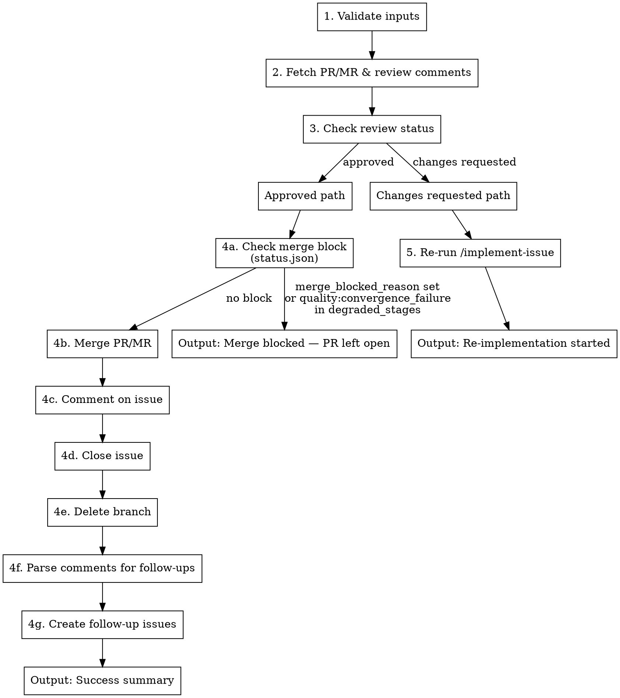

# Process PR/MR

Read PR/MR review comments and act accordingly: if approved, create follow-up issues and merge; if changes requested, re-run implementation.

**Announce at start:** "Using process-pr to process PR/MR #$1 for issue #$2"

**Arguments:**
- `$1` — PR/MR number (required)
- `$2` — Issue number that the PR/MR addresses (required)
- `$3` — Base branch for re-implementation if needed (required)

**Examples:**
- `/process-pr 142 130 aw-next`
- `/process-pr 456 123 main`

## Process



**Why merge first:** Follow-up issues should only be created if the merge succeeds. Creating issues before merge can leave orphaned issues if merge fails (conflict, permissions, etc.). Merging first ensures we only create follow-ups for work that actually landed.

### Step 1: Validate Inputs

```bash
# Verify PR/MR exists and is open
PLATFORM_DIR=".claude/scripts/platform"
"$PLATFORM_DIR/read-mr-comments.sh" "$PR_NUMBER"

# Verify issue exists and is open
"$PLATFORM_DIR/read-issue.sh" "$ISSUE_NUMBER"
```

**If validation fails:** Stop and report error.

### Step 2: Fetch PR/MR & Comments

```bash
# Get PR/MR comments
PLATFORM_DIR=".claude/scripts/platform"
"$PLATFORM_DIR/read-mr-comments.sh" "$PR_NUMBER"
```

**Extract:**
- All PR/MR comments (for review status and follow-up issue extraction)
- PR/MR metadata (title, branch, state)

### Step 3: Parse Review Status from Comments

**IMPORTANT:** Review status is embedded in PR/MR comments by the `implement-issue` skill. Use this explicit algorithm:

**Step 3a: Fetch all PR/MR comments**

```bash
# Get comments as JSON array
PLATFORM_DIR=".claude/scripts/platform"
COMMENTS=$("$PLATFORM_DIR/read-mr-comments.sh" "$PR_NUMBER" | jq -r '.[]')
```

**Step 3b: Extract status from comments (most recent wins)**

```bash
# Parse status using explicit algorithm
parse_review_status() {
    local comments="$1"
    local status=""

    # Process comments in order (last one wins)
    while IFS= read -r comment; do
        # Check for markdown bold format first (preferred)
        if echo "$comment" | grep -q '\*\*Status: APPROVED\*\*'; then
            status="APPROVED"
        elif echo "$comment" | grep -q '\*\*Status: CHANGES_REQUESTED\*\*'; then
            status="CHANGES_REQUESTED"
        # Fallback to plain text format
        elif echo "$comment" | grep -q 'Status: APPROVED'; then
            status="APPROVED"
        elif echo "$comment" | grep -q 'Status: CHANGES_REQUESTED'; then
            status="CHANGES_REQUESTED"
        fi
    done <<< "$comments"

    echo "$status"
}

REVIEW_STATUS=$(parse_review_status "$COMMENTS")
```

**Step 3c: Validate status**

```bash
if [ -z "$REVIEW_STATUS" ]; then
    echo "ERROR: No review status found in PR/MR #$PR_NUMBER comments"
    echo "Expected: Comment containing '**Status: APPROVED**' or '**Status: CHANGES_REQUESTED**'"
    exit 1
fi

echo "Review status: $REVIEW_STATUS"
```

**Status priority:**
1. `**Status: APPROVED**` (markdown bold - preferred)
2. `**Status: CHANGES_REQUESTED**` (markdown bold - preferred)
3. `Status: APPROVED` (plain text - fallback)
4. `Status: CHANGES_REQUESTED` (plain text - fallback)

**Multiple reviews:** The algorithm processes comments in chronological order. The LAST status found wins, representing the most recent review.

---

## If Approved: Merge Path

### Step 4a: Check for Merge Block

Before calling `merge-mr.sh`, read `status.json` to check whether a convergence-failure block is in effect.

```bash
STATUS_JSON="${STATUS_JSON_PATH:-status.json}"
MERGE_BLOCKED_REASON=""

if [[ -f "$STATUS_JSON" ]]; then
    # Prefer the explicit merge_blocked_reason field (written by the orchestrator)
    MERGE_BLOCKED_REASON=$(jq -r '.merge_blocked_reason // empty' "$STATUS_JSON" 2>/dev/null)

    # Fall back to scanning degraded_stages for a quality:convergence_failure entry
    if [[ -z "$MERGE_BLOCKED_REASON" ]]; then
        CONVERGENCE_ENTRY=$(jq -r '(.degraded_stages // [])[] | select(startswith("quality:convergence_failure"))' "$STATUS_JSON" 2>/dev/null | head -1)
        if [[ -n "$CONVERGENCE_ENTRY" ]]; then
            MERGE_BLOCKED_REASON="Quality loop convergence failure recorded in degraded_stages: $CONVERGENCE_ENTRY"
        fi
    fi
fi

if [[ -n "$MERGE_BLOCKED_REASON" ]]; then
    echo "MERGE BLOCKED: $MERGE_BLOCKED_REASON"
    # Post a comment on the PR explaining why it was not merged
    PLATFORM_DIR=".claude/scripts/platform"
    "$PLATFORM_DIR/comment-mr.sh" "$PR_NUMBER" "$(cat <<EOF
## Merge Blocked — Unresolved Quality Feedback

This PR was **not** merged automatically because the quality loop exited with a convergence failure, meaning the reviewer repeatedly flagged the same issues without resolution.

**Block reason:** $MERGE_BLOCKED_REASON

Human review is required before merging. Address the unresolved feedback, then re-run the pipeline or merge manually once the issues are resolved.
EOF
    )"
    # Leave the PR open; do NOT close the issue or delete the branch
    exit 0  # skill exits with merge_blocked status (see output section)
fi
```

**`STATUS_JSON_PATH` override:** If `status.json` is not in the current directory (e.g. when invoked from a different working directory), set `STATUS_JSON_PATH` to the full path before calling this skill.

**`BLOCK_MERGE_ON_CONVERGENCE_FAILURE` env var:** When this variable is explicitly set to `0`, skip the check above and proceed directly to merge (restores the pre-fix behaviour for emergency overrides).

```bash
if [[ "${BLOCK_MERGE_ON_CONVERGENCE_FAILURE:-1}" == "0" ]]; then
    echo "WARN: BLOCK_MERGE_ON_CONVERGENCE_FAILURE=0 — skipping merge-block check"
    MERGE_BLOCKED_REASON=""
fi
```

**If a merge block is set:** Leave the PR open, post the explanatory comment, and output `merge_blocked` status (see Output section). Do not proceed to close the issue or delete the branch.

### Step 4b: Merge PR/MR

```bash
PLATFORM_DIR=".claude/scripts/platform"
"$PLATFORM_DIR/merge-mr.sh" "$PR_NUMBER"
```

**IMPORTANT — do NOT check `mergeStateStatus` directly.** The `UNKNOWN` value is transient (can persist 2–30 s while GitHub recomputes merge status) and is not a reliable signal. `merge-mr.sh` handles all mergeability polling internally — it retries until the state resolves or a hard failure is confirmed. Attempting to read `mergeStateStatus` yourself and treating `UNKNOWN` as a failure will cause spurious aborts on perfectly mergeable PRs.

**If merge fails:**
- Log error with reason
- Stop - do not proceed to close issue or create follow-ups
- Return failure status

### Step 4c: Comment on Issue

```bash
PLATFORM_DIR=".claude/scripts/platform"
"$PLATFORM_DIR/comment-issue.sh" "$ISSUE_NUMBER" "$(cat <<'EOF'
## Completed

Resolved via PR/MR #$PR_NUMBER (merged).

### Follow-up issues created:
- #XXX - Description
- #YYY - Description

(Or "No follow-up issues needed.")
EOF
)"
```

### Step 4d: Close Issue

```bash
PLATFORM_DIR=".claude/scripts/platform"
"$PLATFORM_DIR/transition-issue.sh" "$ISSUE_NUMBER"
```

### Step 4e: Delete Branch

The merge script may handle branch deletion. Verify:

```bash
git ls-remote --heads origin $BRANCH_NAME
```

If still exists:
```bash
git push origin --delete $BRANCH_NAME
```

### Step 4f: Parse Comments for Follow-up Issues

Scan all review comments for indicators of follow-up work:

**Trigger phrases:**
- "create issue for..."
- "follow-up needed:"
- "out of scope but should..."
- "technical debt:"
- "future improvement:"
- "TODO:" (in comments, not code)
- "nice to have:"
- "consider adding:"

**Follow-up classification — determine type before extracting:**

| Classification | Criteria | Action |
|---|---|---|
| **precise** | References a specific file or function AND covers ≤2 files in scope | Create issue immediately — no `needs-explore` label; context is already specific enough |
| **vague** | No file/function reference, broad scope, or uses open-ended trigger phrases alone | Create issue immediately with `needs-explore` label — a later `/enrich-issue` sweep researches and fleshes out the body |

> **Deprecation notice:** A previous version of this skill invoked `/explore` as a nested Claude CLI process to enrich vague follow-ups before creating them. That path is removed. The `batch-orchestrator.sh --enrich-followups` flag now handles enrichment asynchronously via the `enrich-issue` skill, which is idempotent and rate-limit-safe.

Open-ended trigger phrases that signal a **vague** follow-up (create with `needs-explore` label):
`"consider adding:"`, `"nice to have:"`, `"future improvement:"`, `"we could also..."`

Examples:

```
# PRECISE — create issue immediately (no needs-explore label)
"follow-up needed: extract retry logic in scripts/merge-mr.sh:handle_merge() into a shared helper"
"technical debt: auth/token.sh:validate_token doesn't handle clock skew — add leeway param"

# VAGUE — create issue immediately WITH needs-explore label (enrich-issue sweep fleshes out later)
"consider adding more tests"
"future improvement: better error handling throughout"
"nice to have: improve logging"
```

**Extract for each:**
- Title (short description)
- Body (full context from comment)
- Labels (inferred: bug, enhancement, tech-debt)

### Step 4g: Create Follow-up Issues

> **CRITICAL — NEVER use `gh issue create` or `create-issue.sh` directly.** Every follow-up issue MUST go through `create-followup-issue.sh`. It runs `assert_issue_valid` fail-closed before creation, ensuring the body has parseable task lines, a known agent, a resolvable file path, and an `## Acceptance Criteria` section. Writing bodies by hand and bypassing this script produces malformed issues that stall the pipeline and require manual remediation. If `create-followup-issue.sh` exits non-zero for any reason (missing argument, validation failure), log the error and skip that item — do NOT fall back to `gh issue create`.

For each extracted issue, invoke `create-followup-issue.sh`:

```bash
".claude/scripts/create-followup-issue.sh" \
  --title "$ISSUE_TITLE" \
  --description "$EXTRACTED_DESCRIPTION" \
  --task-description "$INFERRED_TASK_DESCRIPTION" \
  --file-path "$FILE_PATH" \
  --pr-number "$PR_NUMBER" \
  --issue-number "$ISSUE_NUMBER" \
  --reviewer "$REVIEWER" \
  --labels "${LABELS}" \
  --type precise   # or: --type vague (adds needs-explore label)
```

**`--file-path` is required** — extract it from the `[File:Line]` reference in the review comment. If the review item mentions a function or concept but no file path, use the primary file changed in the PR/MR diff as the fallback. If no file can be determined at all, pass `"."` (the script will infer agent `"default"` and the issue will be valid). Never omit `--file-path`.

Log each: `Created follow-up issue #XXX: "$TITLE"` (or `"$TITLE" (needs-explore)` for vague items).

---

## If Changes Requested: Re-implementation Path

### Step 5: Re-run implement-issue

When the code reviewer requests changes, spawn a new implementation session:

```bash
claude --dangerously-skip-permissions \
  --print \
  "/implement-issue $ISSUE_NUMBER $BASE_BRANCH" \
  2>&1 | tee -a logs/process-pr-rerun-$(date +%Y%m%d-%H%M%S).log
```

**Notes:**
- The implement-issue skill will:
  - Read the existing PR/MR and review comments
  - Address the requested changes
  - Push to the same branch (updating the PR/MR)
  - Run code review again
- After implement-issue completes, call `/process-pr` again to check the new review

**Log:**
```
Changes requested on PR/MR #$PR_NUMBER. Re-running implementation for issue #$ISSUE_NUMBER...
```

---

## Output

### Success (Approved & Merged)

```
## Process PR/MR Complete

**PR/MR:** #$PR_NUMBER
**Issue:** #$ISSUE_NUMBER
**Status:** ✅ Merged

### Actions Taken
- [x] Review status: APPROVED
- [x] Merge block check: no block
- [x] Created N follow-up issues
- [x] PR/MR merged
- [x] Issue #$ISSUE_NUMBER closed
- [x] Branch deleted

### Follow-up Issues Created
| Issue | Title | Labels |
|-------|-------|--------|
| #XXX | Description | enhancement |
```

### Merge Blocked (Convergence Failure)

```
## Process PR/MR: Merge Blocked

**PR/MR:** #$PR_NUMBER
**Issue:** #$ISSUE_NUMBER
**Status:** ⛔ Merge blocked — PR left open

### Block Reason
$MERGE_BLOCKED_REASON

### Actions Taken
- [x] Review status: APPROVED
- [x] Merge block check: BLOCKED
- [ ] PR/MR merge — SKIPPED (blocked)
- [ ] Issue close — SKIPPED (blocked)
- [ ] Branch delete — SKIPPED (blocked)

### Next Steps
Human review is required. Address the unresolved quality feedback listed above,
then merge manually or re-run the pipeline once the issues are resolved.
```

### Re-implementation (Changes Requested)

```
## Process PR/MR: Changes Requested

**PR/MR:** #$PR_NUMBER
**Issue:** #$ISSUE_NUMBER
**Status:** 🔄 Re-implementing

### Review Feedback
$REVIEW_COMMENTS_SUMMARY

### Action
Re-running /implement-issue $ISSUE_NUMBER $BASE_BRANCH to address requested changes.
```

## Error Handling

| Failure Point | Action |
|---------------|--------|
| Validation fails | Stop, report error |
| No review status in comments | Stop, report - need code review comment with Status line first |
| `merge_blocked_reason` set in `status.json` | Leave PR open, post block comment, return `merge_blocked` — do NOT close issue or delete branch |
| `quality:convergence_failure` in `degraded_stages` | Same as above (fallback when `merge_blocked_reason` absent) |
| Issue creation fails (`create-followup-issue.sh` exits non-zero) | Log warning, skip that item — NEVER fall back to `gh issue create` or `create-issue.sh` |
| Merge fails | Stop, return failure, do NOT close issue |
| Issue close fails | Log warning (merge succeeded) |
| Branch delete fails | Log warning (best-effort) |
| Re-implementation fails | Log error, include in output |

## Integration

**Called by:**
- `handle-issues` skill (after implement-issue creates PR/MR)
- User directly via `/process-pr <pr> <issue> <branch>`

**Calls:**
- `/implement-issue` (when changes requested)

**Requires:**
- Platform CLI authenticated (gh, glab, or acli — configured in .claude/config/platform.sh)
- PR/MR must exist with a code review comment containing `**Status: APPROVED**` or `**Status: CHANGES_REQUESTED**`
- Issue must exist and be open

## Example Sessions

### Approved PR/MR

```
User: /process-pr 142 130 aw-next

Claude: Using process-pr to process PR/MR #142 for issue #130

Validating... PR/MR #142 open, Issue #130 open
Parsing comments... Status: APPROVED, 1 follow-up found
Creating issue #145: "Add rate limiting to auth endpoint"
Merging PR/MR #142... Merge successful
Closing issue #130... done
Deleting branch issue-130-auth-redirect... done

## Process PR/MR Complete
PR/MR: #142 | Issue: #130 | Status: Merged
Follow-up: #145 - Add rate limiting to auth endpoint
```

### Changes Requested

```
User: /process-pr 142 130 aw-next

Claude: Using process-pr to process PR/MR #142 for issue #130

Validating... PR/MR #142 open, Issue #130 open
Parsing comments... Status: CHANGES_REQUESTED
Feedback: "Need to handle edge case when session expires"

Re-running /implement-issue 130 aw-next...
[spawns headless session]
```

## Machine-Readable Result Output

When invoked via `batch-orchestrator.sh` with `--json-schema`, this skill's output is parsed for structured data. To ensure reliable extraction, **always end your execution with a clear result statement**.

### Final Result Output

At the **very end** of execution, output a clear status summary. This helps `--json-schema` reliably extract the structured output.

**On successful merge:**
```
## Result

Status: merged
Follow-up issues: #145, #146
```

**On merge with no follow-ups:**
```
## Result

Status: merged
Follow-up issues: none
```

**On changes requested:**
```
## Result

Status: changes_requested
```

**On merge blocked (convergence failure):**
```
## Result

Status: merge_blocked
Error: Quality loop convergence failure recorded in degraded_stages: quality:convergence_failure:quality:iter=2
```

**On error:**
```
## Result

Status: error
Error: Merge failed - conflict with base branch
```

**On rate limit:**
```
## Result

Status: rate_limit
Error: Platform API rate limit exceeded
```

### Result Schema

The `batch-orchestrator.sh` uses this JSON schema to extract results:

```json
{
  "type": "object",
  "properties": {
    "status": {"enum": ["merged", "changes_requested", "merge_blocked", "error", "rate_limit"]},
    "follow_up_issues": {"type": "array", "items": {"type": "string"}},
    "error": {"type": "string"}
  },
  "required": ["status"]
}
```

**Important:** The final result section must be the last significant output. The `--json-schema` flag asks Claude to summarize the execution according to this schema, so ending with a clear status makes extraction reliable.

## Red Flags

| Temptation | Why It Fails |
|------------|--------------|
| Call `gh issue create` directly for a follow-up | Bypasses `assert_issue_valid` — produces bodies with no task lines, no agent, no ACs; stalls the pipeline and requires manual remediation |
| Call `create-issue.sh` with a hand-written body | Same bypass — `create-issue.sh` only gates bodies that already contain `## Implementation Tasks`; a prose body has no such marker and slips through unvalidated |
| Omit `--file-path` because no file was mentioned | `create-followup-issue.sh` exits 3 (missing arg); pass `"."` as fallback to get `default` agent inference — never omit the flag |
| Write the issue body inline before calling the script | The script generates and validates the body deterministically from its arguments; writing a body manually defeats the entire purpose |
